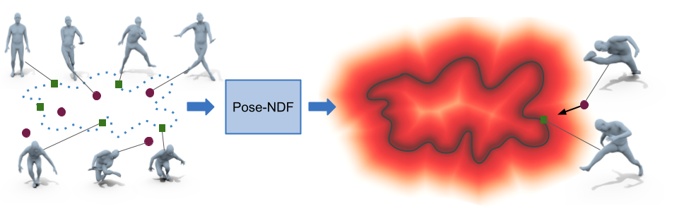

## Pose-NDF: Modeling Human Pose Manifolds with Neural Distance Fields
 
This repository contains official implementation of ECCV-2022 paper: Pose-NDF: Modeling Human Pose Manifolds with Neural Distance Fields ([Project Page](https://virtualhumans.mpi-inf.mpg.de/posendf/))

  

## Installation: 
Please follow [INSTALL.md](INSTALL.md)

## Training and Dataset

#### 1. Download AMASS: Store in a folder "amass_raw"". You can train the model for SMPL/SMPL+H or SMPL+X. 
    https://amass.is.tue.mpg.de/

#### 2.1 Sample poses from AMASS:
    python data/sample_poses.py --sampled_pose_dir <path_for_samples_amass_poses> --amass_dir <amass_dataset_dir>

sample_poses.py is based on [VPoser data preparation](https://github.com/nghorbani/human_body_prior/tree/master/src/human_body_prior/data). If you already have this processed data, you can directly use it. You just need to convert .pt file to .npz file. 

#### 2.2 Create script for generating training data :
    python data/prepare_data.py --raw_data <path_for_samples_amass_poses> --out_path <path_for_training_data> --bash_file ./traindata.sh 

If you are using slurm then add "--use_slurm" and change please change the path on environment and machine specs in L24:L30 in data/prepare_data.py

#### 2.3 Create  training data :
    ./traindata.sh 

During training the dataloader reads file form data_dir/. You can now delete the amass_raw directory. 
For all our experiments, we use the same settings as used in VPoser data preparation step.

#### 3. Edit configs/<>.yaml for different experimental setup
    experiment:
        root_dir: directory for training data/models and results
    model:     #Network acrhitecture
        ......
    training:  #Training parameters
        ......
    data:       #Training sample details
        .......

Root directory will contain dataset, trained models and results. 

#### 4. Training Pose-NDF :
    python trainer.py --config=configs/amass.yaml

amass.yaml contains the configs used for the pretrained model. 

#### 4. Download pre-trained model :  [Pretrained model](https://nextcloud.mpi-klsb.mpg.de/index.php/s/4zxN93WL769pSAK)

## Inference 

Pose-NDF is a continuous model for plausible human poses based on neural distance fields (NDFs). This can be used to project non-manifold points on the learned manifold and hence act as prior for downstream tasks.

### Pose generation
    python trainer.py --config=configs/amass.yaml --test 

This code randomly samples points in input pose space and project them on the learned manifold to generate realsitic poses. 

### Pose interpolation
     python experiment/interp.py --config=configs/amass.yaml 

### Motion denoising
     python experiment/motion_denoise.py --config=configs/amass.yaml  --motion_data=<motion data file>

Motion data file is .npz file which contains "body_pose", "betas", "root_orient"

### Image based 3d pose estimation
     1. Run openpose to generate 2d keypoints for given image(https://github.com/CMU-Perceptual-Computing-Lab/openpose).
     2. python experiment/image_pose.py --config=configs/amass.yaml  --image_dir=<image data dir>

Both image and corresponding keypoint should be in same directory with <image_name>.jpg and <image_name>.json being the image and 2d keypoints file respectively.

### Citation:
    @inproceedings{tiwari22posendf,
        title = {Pose-NDF: Modeling Human Pose Manifolds with Neural Distance Fields},
        author = {Tiwari, Garvita and Antic, Dimitrije and Lenssen, Jan Eric and Sarafianos, Nikolaos and Tung, Tony and Pons-Moll, Gerard},
        booktitle = {European Conference on Computer Vision ({ECCV})},
        month = {October},
        year = {2022},
        }

